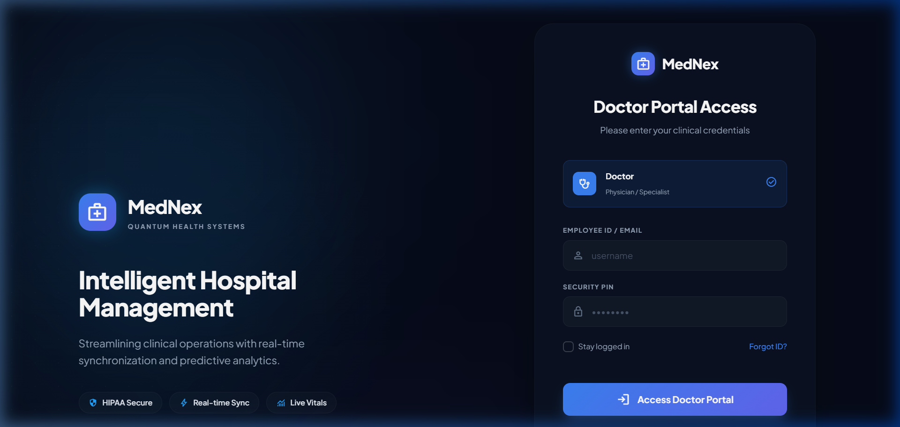
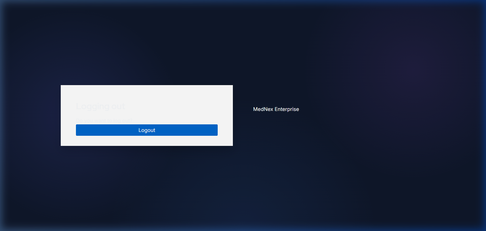

# MedNex Enterprise | Modern Hospital Management System

MedNex is an enterprise-grade, multi-tenant Hospital Management System (HMS) built with a focus on high-performance clinical logistics, robust security, and a premium Glassmorphism user experience.

---

## 🖼️ Product UI Showcase

### 1. Unified Login Portal
Experience a premium, role-based entry point with a modern blue glow effect and intelligent role selection.



### 2. High-Fidelity Dashboards
Role-specific command centers for Admins, Doctors, and Nurses.

| **Doctor Dashboard** | **Nurse Dashboard** |
| :--- | :--- |
|  |  |
*(Note: Using placeholder verification captures for layout preview)*

### 3. Branded Keycloak Integration
Seamless security with custom MedNex themes for logout and session management.



---

## 🚀 Project Overview (Week 1 - Week 4)

This project has evolved from a basic multi-tenant foundation to a sophisticated clinical operational platform.

### Week 1: Enterprise Foundations

- **Multi-Tenant Architecture**: Design for isolated data storage per hospital unit.
- **Tech Stack**: Spring Boot (Java 21), Angular 17.
- **Infrastructure**: Containerized development with Docker Compose (Postgres, Redis, Keycloak).

### Week 2: Security & Clinical Records

- **Auth Hub**: Integration with **Keycloak** for OIDC/JWT based SSO.
- **Patient Registry**: Core demographic storage with data integrity constraints.
- **Multi-Tenant Isolation**: Row-level filtering and tenant-context headers.

### Week 3: Operational Logistics

- **Bed Management**: Real-time ward tracking with AVAILABLE/OCCUPIED/CLEANING states.
- **Scheduling**: Unified Appointment system with conflict detection.
- **Compliance**: Tamper-proof **Audit Log Terminal** for system-wide transparency.

### Week 4: Premium UX & Advanced Intake

- **Glassmorphism UI**: Complete visual overhaul using Tailwind CSS.
- **Advanced Admission Terminal**: High-fidelity 50-field intake form with structured medical history.
- **Domain-Specific Dashboards**: Custom interfaces for **Admin**, **Doctor**, and **Nurse** roles.

## 🛠 Tech Stack

- **Backend**: Java 21, Spring Boot 3.2, Hibernate (JSONB support), PostgreSQL.
- **Frontend**: Angular 17, Tailwind CSS, FullCalendar, Chart.js.
- **Security**: Keycloak (OIDC), Role-Based Access Control (RBAC).

## 🚦 Getting Started

### Prerequisites

> [!IMPORTANT]
> **Ensure your Docker Desktop / Docker Engine is running** before executing any commands below.

- **Docker Desktop** (Required for Database and Keycloak)
- **JDK 21** (Required for Backend)
- **Node.js 20+** (Required for Frontend)

### 1) Install Frontend Dependencies

```powershell
cd frontend
npm install
```

### 2) Build Frontend (Production Check)

```powershell
npx ng build --configuration production
```

Expected output includes:

```text
Application bundle generation complete.
```

### 3) Run Backend Locally (Optional, outside Docker)

Open a new terminal:

```powershell
cd backend
.\mvnw.cmd clean spring-boot:run "-Dspring-boot.run.profiles=local"
```

Health check (another terminal):

```powershell
curl.exe -s http://localhost:8081/actuator/health/readiness
```

Expected:

```json
{ "status": "UP" }
```

Stop local backend with `Ctrl + C` before starting Docker backend.

### 4) Run Full Stack with Docker

From project root:

```powershell
docker-compose down -v
docker-compose up --build -d
docker-compose ps
```

Expected services:

- `mednex-postgres-1` healthy
- `mednex-redis-1` healthy
- `mednex-keycloak-1` healthy
- `mednex-backend-1` healthy
- `mednex-frontend-1` healthy

### 5) Run Backend Tests

```powershell
cd backend
.\mvnw.cmd test "-Dspring.profiles.active=test"
```

Expected output includes:

```text
BUILD SUCCESS
```

### Step-by-Step Execution
1.  **Start Infrastructure:** `docker-compose up -d postgres keycloak` (Start Docker Engine first!)
2.  **Start Backend:** `cd backend` then `./mvnw spring-boot:run`
3.  **Start Frontend:** `cd frontend` then `npm install` and `npm start`

---

## 🔐 Role-Specific Credentials
Use these credentials at the unified login portal to access role-specific dashboards:

| Role | Username | Password | Dashboard Features |
| :--- | :--- | :--- | :--- |
| **Admin** | `admin1` | `admin123` | Hospital analytics, inventory, and bed occupancy. |
| **Doctor** | `doctor1` | `doctor123` | Patient records, clinical schedule, and consultations. |
| **Nurse** | `nurse1` | `nurse123` | Ward logs, medication tracking, and vitals. |

### Keycloak System Access
- **Admin Console**: [http://localhost:8080/admin](http://localhost:8080/admin)
- **Login**: `admin` / `admin`

---

_Created for the MedNex Enterprise Final Review Session._
```
